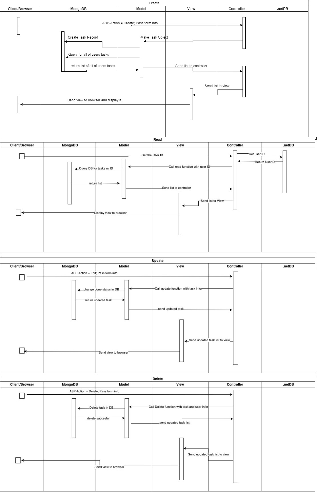
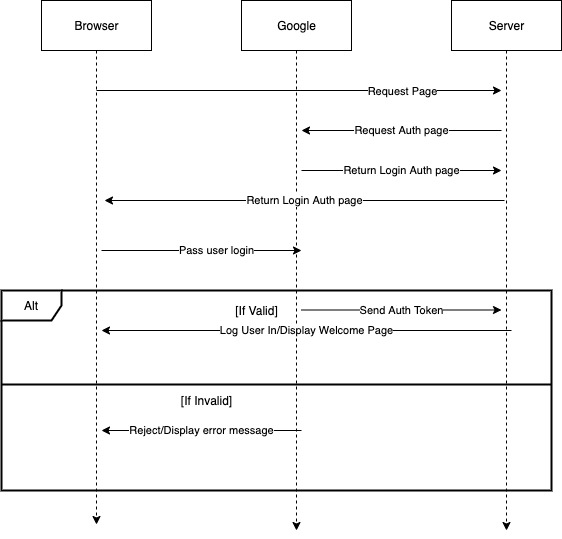
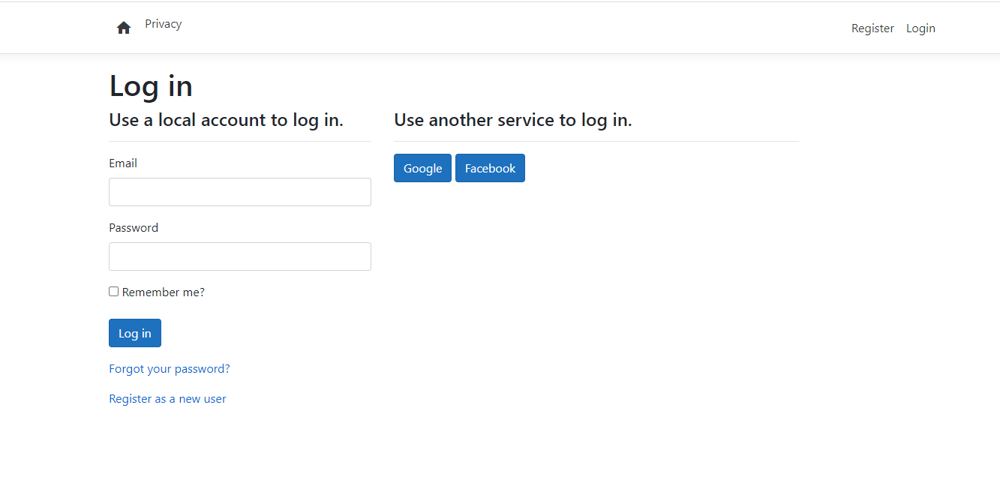
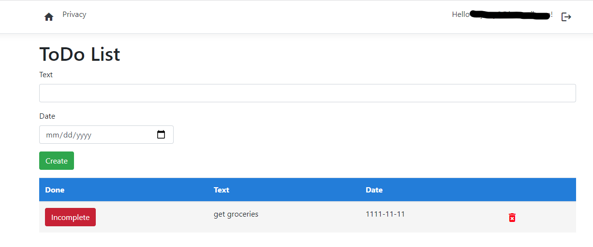
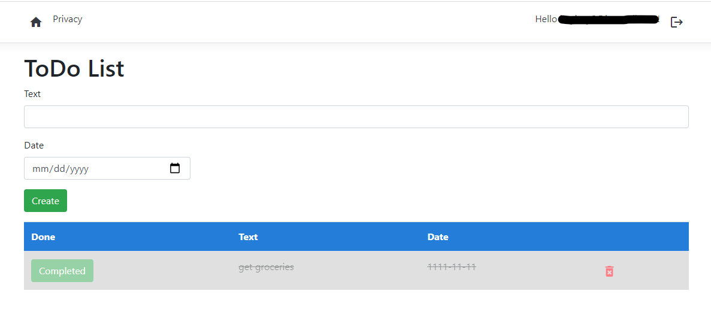

# Lab 5 Writeup #
## Introduction ##
Koy Bennion  
Nov 3, 2021  
Lab 5  
## Executive Summary ##
In this lab, I learned how to use .Net framework by interacting with MVC and creating a project from scratch. This lab challenged me to learn new concepts including C#, MVC, and asynchronous programming. It also taught me how to set up OAuth for my website using multiple services such as Google and Facebook. One thing that I struggled with during this lab was understanding how the model interacted with my database. Through online help I was able to understand how to interact with my database by creating a model and setting up connection strings.
## Design Overview ##
### UML ###

<strong>UML Sequence diagram that briefly explains the CRUD functions operations
  

UML Sequence Diagram that briefly explains the process of authenticating a user

### Screenshots ###

The Authentication page which can authenticate users through email, google, and facebook
  

A look at what the ToDo list app looks like when a task isn't complete
  

A look at what the ToDo list app looks like when a task is complete
  

</strong>

## Questions ##
- In the context of MongoDB compared to SQL databases, what's a Document? What's a Collection?
  - A document in MongodDb is the way that MongoDB stores data. They store records as BSON document which is like JSON but contains more datatypes. The documetn user Field:Value pairs as their structure. A collection is a storage of many documents. They are similar to tables in relational databases.
- When you log in with Google, where is the hash of your password stored? Your app, Google, or both?
  - The hash password is not stored on our server. The passwords are stored with google. The only thing that our server does is send an authentication token. Other than that the passwords and credentials are saved on googles servers.
- What's the difference between using Cloud services to store data (like Atlas) and storing data locally with something like MySQL? List 2 benefits of each approach.
  - Using the cloud cuts down on costs and is great for small businesses who dont have a lot of data. But it is also very usable for bigger companies because it removes scalability issues as companies grow. They are also a great way to protect yourself from ransomware since backups are readily available. As for locally hosting, there is a big benefit when it comes to speed. With cloud the downloads/uplaods are over the internet while having local storage is done over the network. Security is a big plus as well for local storage becuse you have complete control over who has access, how its stored, etc.
- List 3 core features of fully-fledged IDE's like Visual Studio that give them an advantage over text-editors like Sublime or VSCode.
  - Has pre-written code libraries
  - Templates/Scaffolding
  - has Security services already installed
- What is the role of a Model?
  - The role of the model is to represent the essential information like database fields of our application and to connect that information to the database. It is the essential component of MVC and allows the view and controller to connect with user data.
- What is the role of a View?
  - The role of the view is to dynamically provide the user with display. Thye interact with controller to be able to display user data. They use razor files in order to display html as well as C#
- What is the role of a Controller?
  - The role of the controller is to handle user browser requests and direct them to the correct pages. It is a mediator between the model and the view when it comes to the control of data transmission. It is also able to handle input and then conver it to commands for the model or view.
- List 3 pros and 3 cons of hosting your website on the cloud.
  - Pros
    - More reliable. Since our website is hosted on several interconnected servers which all store the same info, if one of the servers goes down we dont lose service because one of the other cloud servers will be running
    - Price. Traditional hosting can be costly due to the need for capacity and scaling. This becomes expensive as servers need to be upgraded to handle large internet traffic. With cloud you can add another virtual server that can handle the traffic more easily and it costs less to do so. 
    - Security. Security is a lot better in cloud hosting when it comes to preventing viruses and malware since they can be isolated to one virtual machine and cant spread throughout your network since your servers are on the cloud.
  - Cons
    - Data Confidentiality. There is always a a risk that user data could be leaked or accessed by other people.
    - Internet connection. If your internet isnt great, getting service can be slow and tedious. Also, if your internet goes out there is no way to access your data
    - Support. If there is a service outage or there is a problem with your server you do not have direct power to fix it. Instead you have to go through customer support queues that may not get back to you very fast. 
## Lessons Learned ##
### MVC uses asp-for to correctly pass data ###
In MVC, the data is user input is passed from the view to the controller in order to interact with the model. The problem is that asp-for must contain the exact data used in the model. This happens even if the word is not properly capitalized. If not, the model will not accept input and the controller will return an error. In order to solve this problem the programmer will have to put an `asp-for` for every essential field so that their information will able to interact with the model and database later on.  
### Using the DAO ###
The DAO is the main way to manipulate data. It interacts with the contoller and then the model in order to manipulate information. Problems occur when a programmer does not include the necessary fields used in the function. Most CRUD function contain a `Bind` statement that prepares the object to be used in the DAO. If the programmer doesn't include the necessary fields for the `Bind` statement then the model state becomes invalid and data does to get written. To resolve this the programmer will need to examine the necessary fields used in the bind statement so that the function can successfully create an object and use it in the DAO.
### Using 3rd Party Oauth ###
TOne of the easiest way to handle user accounts and passwords is using 3rd Party authentication. One of the main problems that occur is improper handling of clientid's and clientsecrets which causing authentication to fail. If mishandled or misplaced, the programmer can expose users and the program alike to outside threats. One way to solve this is by taking advantage of the built in features of Visual Studio like using the `secrets.json` file to keep sensitive information away from the public.
## Conclusions ##
- Pass data from the controller to the view using `Viewdata[]`
- Authorize users using 3rd Party Authentication methods
- Interact with the database through the model
- Retrieve data from the database and display it in the view
- Use asynchronous methods effectively in code
- Utilize pre-built bootstrap css to design and organize a webpage
- Create a project using Visual Studio
- Create a collection in MongoDB then interact with it through my application
## References ##
SO page that helped me fix my facebook authentication: [SO-AuthenticationBuilder Error](https://stackoverflow.com/questions/54776258/authenticationbuilder-does-not-contain-a-definition-for-addazuread)  
SO article that helped me find model error: [SO-ModelState.IsValid](https://stackoverflow.com/questions/881281/what-is-modelstate-isvalid-valid-for-in-asp-net-mvc-in-nerddinner)  
Bootstarp documentation page for using pre-built buttons: [Buttons](https://getbootstrap.com/docs/4.0/components/buttons/)

