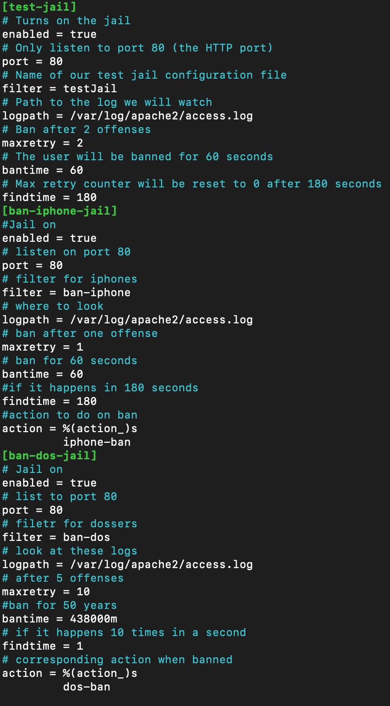
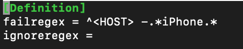

# Lab 5 #
## Introduction ##
Koy Bennion  
11-17-2021  
Lab 5  
## Executive Summary ##
This lab introduced the concept of API. In this lab we were required to test and create functions to interact with an API. I accomplished this by using python to create requests using HTTP methods such as POST, GET, PUT, and DELETE. Using these methods, I created a couple of functions that would manipulate the data using the requests. To test that the endpoints of the api were working I created a separate file where I tested each endpoint of the API. If any tests failed, my code would let me know where and what the expected value should have been. By doing this, I was able to test the API for errors and find where the problems needed to be fixed. In the second part of the lab, we dealt with server hardening and using fail2ban to stop certain traffic or users from using our website. We also installed a firewall to further protect our server.
## Design Overview ##
### Lab 5a Files ###
`api.py`: this file contained the main functions for the api and made requests using predefined endpoints with session endpoints  
`test_api.py`: this file contained 12 tests that tested for mistakes or errors in the api request using `assert` statements.  
### Lab 5b Files ###
All the files were stored on the server but the main files and what makes them up can be found [here](./labRead.md)
### Screenshots ###
A photo of the Jails that were created for fail2ban
  

A photo of the fail2ban regex of preventing iPhone from accessing the site  

  

A photo of the fail2ban regex that banned people who pinged the site 10 or more times in 1 second  

  

## Questions ##
- Name and discuss at least two of the benefits of writing unit tests before writing code.
  - By planning out your unit tests, you have a better idea of how your code will work and you'll thank yourself later as it provides a lot better detail than a random error code when you run your project. Not only that but it gives you an idea of where you could make errors while you do begin writing your code and can give you some foresight on how the data is going to be interpreted.
- What would be some of the benefits of automating your test scripts (i.e. so they run at each commit)?
  - By automating your test scripts, you can receive better error codes and can see where your code has gone wrong at each error point. Automating can also speed up you’re testing and can help you find and fix bugs quicker thus making the development process shorter in the long run.
- How long did this lab take for you?
  - It took me roughly 4 hours
## Lessons Learned ##
- Regex is very nitty gritty
  - Regex is a complicated language but at the same time extremely useful. The main problem is getting it to match things you want and nothing you don't. This is hard especially when each request might be slightly different. This happens because sometimes information is coming from different sources. In order to mitigate this problem, it’s important to analyze the incoming information for patterns and then use a regex tester to see if your regex is matching the things you want.
- Python Classes
  - Python classes are similar to normal classes in other programming languages but what is really strange is the use of the `self` identifier. This was really confusing and not understanding it can create errors in your code. This happens mostly form lack of knowledge or familiarity with python. By reading up on how classes are instantiated the `self` identifier can be interpreted to be like a `this.` in other languages. Although this is not all that it is and does, it helps with understanding the basics of how to use it in this lab.
- Understanding how Assert and Unit Testing work
  - This lab uses unit testing to test the endpoints. There isn't a lot of discussion on how it works so during the lab it can be hard to understand how it interacts with `api.py`. Along with unit testing, comes the `assert` statements which can be difficult to understand their purpose. By looking at the examples in the lab, you can start to get a sense that the Unit Test is kind of like a class that goes through every function inside its block and runs them. Then it uses the asserts to throw and error wherever it doesn't properly complete its intended action.
## Conclusions ##
- Use python to make HTTP requests to an API
- Use unit testing to look for potential problems or errors in API endpoints
- Setup fail2ban regex expressions to catch suspicious or malicious activity on my website
- Create a python script to notify me of ips that get banned
- Implement `assert` statements to help me find where errors have occurred
- Interact with Linux CLI to modify local files and change default values
## Resources ##
[How to send an email with python](https://realpython.com/python-send-email/)  
[Common fail2ban commands](https://www.fail2ban.org/wiki/index.php/Commands)  
[How to use filters in different ways](https://fail2ban.readthedocs.io/en/latest/filters.html)

