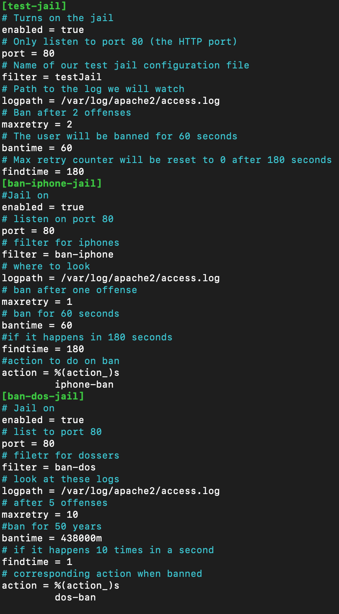
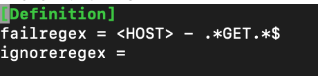
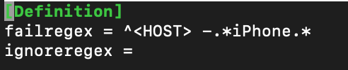
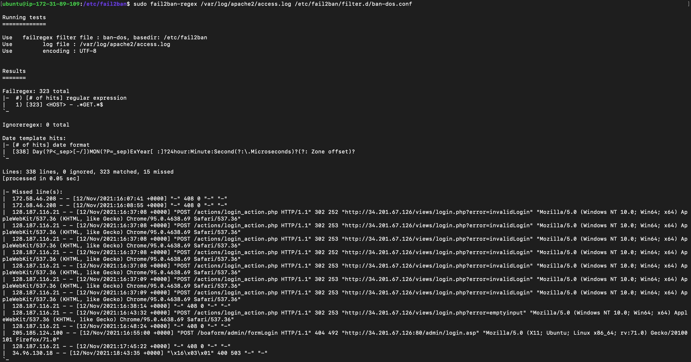
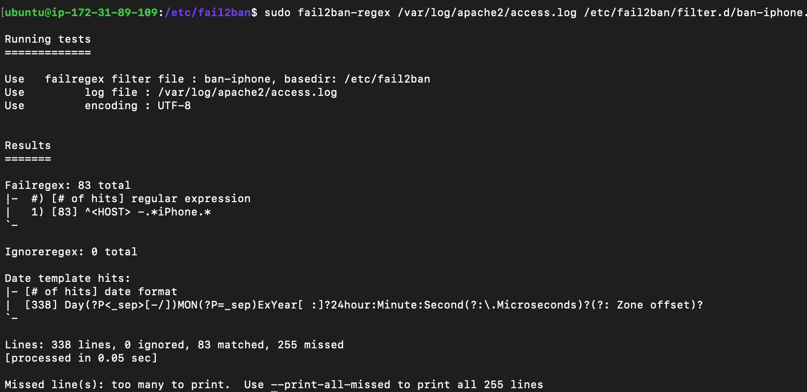
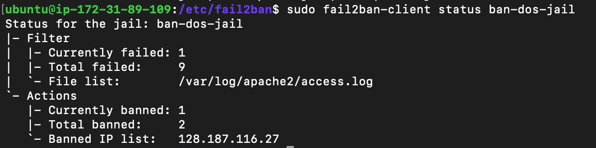
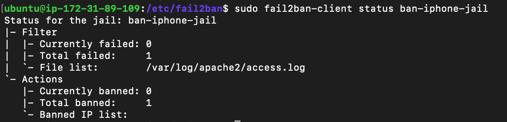
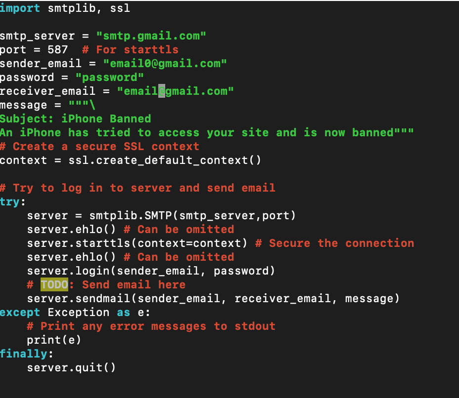

# Server Hardening Documentation

__Name__: Koy Bennion

## Fail2Ban Log

## Custom Jails

### `jail.local`

### `filter.d/jail.conf`

...

## `fail2ban-regex`
DDOS Regex

Prevent Iphone Regex

DDOS Ban Log

Iphone Ban Log

## Python script

The python script for both of the jails is similar in its function so thats why I only included one photo. The basics of the script is that it uses built in libraries to create a tls connection with googles smtp server. After that is established the script will need the source user credentials, destination user's email, and a message so that the connection can be established and the email can be sent.
